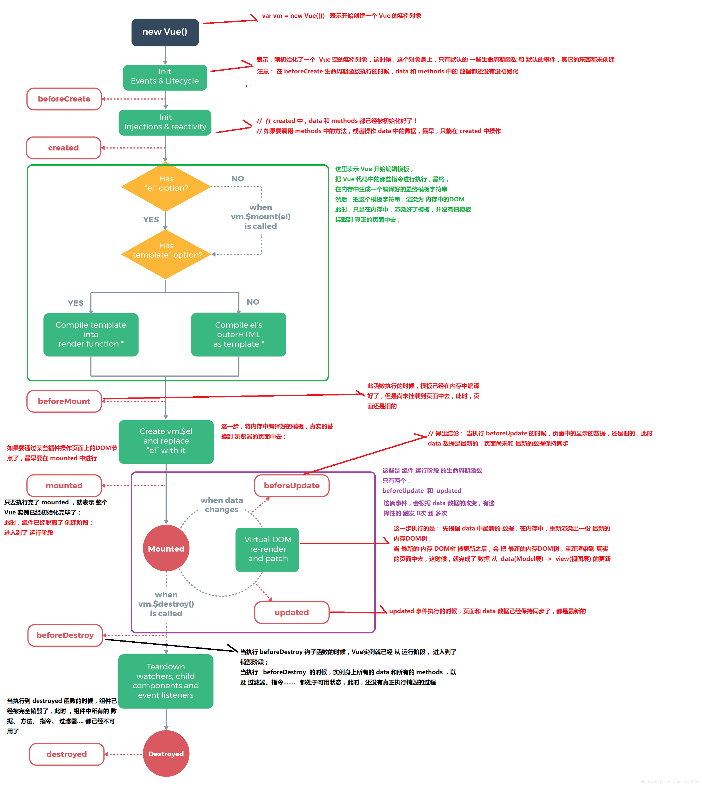

#### 你对MVVM的理解?
MVVM 模式，顾名思义即 Model-View-ViewModel 模式。它萌芽于2005年微软推出的基于 Windows 的用户界面框架 WPF ，前端最早的 MVVM 框架 knockout 在2010年发布。

Model 层: 对应数据层的域模型，它主要做域模型的同步。通过 Ajax/fetch 等 API 完成客户端和服务端业务 Model 的同步。在层间关系里，它主要用于抽象出 ViewModel 中视图的 Model。

View 层:作为视图模板存在，在 MVVM 里，整个 View 是一个动态模板。除了定义结构、布局外，它展示的是 ViewModel 层的数据和状态。View 层不负责处理状态，View 层做的是 数据绑定的声明、 指令的声明、 事件绑定的声明。

ViewModel 层:把 View 需要的层数据暴露，并对 View 层的 数据绑定声明、 指令声明、 事件绑定声明 负责，也就是处理 View 层的具体业务逻辑。ViewModel 底层会做好绑定属性的监听。当 ViewModel 中数据变化，View 层会得到更新；而当 View 中声明了数据的双向绑定（通常是表单元素），框架也会监听 View 层（表单）值的变化。一旦值变化，View 层绑定的 ViewModel 中的数据也会得到自动更新。

#### vue底层实现原理
（https://juejin.im/post/5c21a306e51d4526262966c3）
（https://www.html.cn/interview/15331.html）
（https://blog.fundebug.com/2019/07/10/responsive-vue/）

#### Proxy与Object.defineProperty的优劣对比?
（https://github.com/YvetteLau/Blog/issues/25）
（https://juejin.im/post/5acd0c8a6fb9a028da7cdfaf#heading-12）

#### vue常用的修饰符
（https://segmentfault.com/a/1190000016786254）

#### vue中 keep-alive 组件的作用?
（https://juejin.im/post/5b407c2a6fb9a04fa91bcf0d）

#### Vue生命周期的理解？

Vue 实例有一个完整的生命周期，也就是从开始创建、初始化数据、编译模版、挂载Dom -> 渲染、更新 -> 渲染、卸载等一系列过程，我们称这是Vue的生命周期。

beforeCreate	组件实例被创建之初，组件的属性生效之前
created	组件实例已经完全创建，属性也绑定，但真实dom还没有生成，$el还不可用
beforeMount	在挂载开始之前被调用：相关的 render 函数首次被调用
mounted	el 被新创建的 vm.$el 替换，并挂载到实例上去之后调用该钩子
beforeUpdate	组件数据更新之前调用，发生在虚拟 DOM 打补丁之前
update	组件数据更新之后
activited	keep-alive专属，组件被激活时调用
deadctivated	keep-alive专属，组件被销毁时调用
beforeDestory	组件销毁前调用
destoryed	组件销毁后调用

#### 异步请求适合在哪个生命周期调用？
官方实例的异步请求是在mounted生命周期中调用的，而实际上也可以在created生命周期中调用。

#### Vue组件如何通信？
Vue组件通信的方法如下:

props/$emit+v-on: 通过props将数据自上而下传递，而通过$emit和v-on来向上传递信息。
EventBus: 通过EventBus进行信息的发布与订阅
vuex: 是全局数据管理库，可以通过vuex管理全局的数据流
$attrs/$listeners: Vue2.4中加入的$attrs/$listeners可以进行跨级的组件通信
provide/inject：以允许一个祖先组件向其所有子孙后代注入一个依赖，不论组件层次有多深，并在起上下游关系成立的时间里始终生效，这成为了跨组件通信的基础。

#### computed和watch有什么区别?
computed:

computed是计算属性,也就是计算值,它更多用于计算值的场景
computed具有缓存性,computed的值在getter执行后是会缓存的，只有在它依赖的属性值改变之后，下一次获取computed的值时才会重新调用对应的getter来计算
computed适用于计算比较消耗性能的计算场景
watch:

更多的是「观察」的作用,类似于某些数据的监听回调,用于观察props $emit或者本组件的值,当数据变化时来执行回调进行后续操作
无缓存性，页面重新渲染时值不变化也会执行
小结:

当我们要进行数值计算,而且依赖于其他数据，那么把这个数据设计为computed
如果你需要在某个数据变化时做一些事情，使用watch来观察这个数据变化

#### 你是如何理解Vue的响应式系统的?
（https://www.cxymsg.com/guide/reactivity.html）

#### 既然Vue通过数据劫持可以精准探测数据变化,为什么还需要虚拟DOM进行diff检测差异?
考点: Vue的变化侦测原理

前置知识: 依赖收集、虚拟DOM、响应式系统

现代前端框架有两种方式侦测变化,一种是pull一种是push

pull: 其代表为React,我们可以回忆一下React是如何侦测到变化的,我们通常会用setStateAPI显式更新,然后React会进行一层层的Virtual Dom Diff操作找出差异,然后Patch到DOM上,React从一开始就不知道到底是哪发生了变化,只是知道「有变化了」,然后再进行比较暴力的Diff操作查找「哪发生变化了」，另外一个代表就是Angular的脏检查操作。

push: Vue的响应式系统则是push的代表,当Vue程序初始化的时候就会对数据data进行依赖的收集,一但数据发生变化,响应式系统就会立刻得知,因此Vue是一开始就知道是「在哪发生变化了」,但是这又会产生一个问题,如果你熟悉Vue的响应式系统就知道,通常一个绑定一个数据就需要一个Watcher,一但我们的绑定细粒度过高就会产生大量的Watcher,这会带来内存以及依赖追踪的开销,而细粒度过低会无法精准侦测变化,因此Vue的设计是选择中等细粒度的方案,在组件级别进行push侦测的方式,也就是那套响应式系统,通常我们会第一时间侦测到发生变化的组件,然后在组件内部进行Virtual Dom Diff获取更加具体的差异,而Virtual Dom Diff则是pull操作,Vue是push+pull结合的方式进行变化侦测的.

#### Vue为什么没有类似于React中shouldComponentUpdate的生命周期？
考点: Vue的变化侦测原理

前置知识: 依赖收集、虚拟DOM、响应式系统

根本原因是Vue与React的变化侦测方式有所不同

React是pull的方式侦测变化,当React知道发生变化后,会使用Virtual Dom Diff进行差异检测,但是很多组件实际上是肯定不会发生变化的,这个时候需要用shouldComponentUpdate进行手动操作来减少diff,从而提高程序整体的性能.

Vue是pull+push的方式侦测变化的,在一开始就知道那个组件发生了变化,因此在push的阶段并不需要手动控制diff,而组件内部采用的diff方式实际上是可以引入类似于shouldComponentUpdate相关生命周期的,但是通常合理大小的组件不会有过量的diff,手动优化的价值有限,因此目前Vue并没有考虑引入shouldComponentUpdate这种手动优化的生命周期.

#### Vue中的key到底有什么用？
key是为Vue中的vnode标记的唯一id,通过这个key,我们的diff操作可以更准确、更快速

diff算法的过程中,先会进行新旧节点的首尾交叉对比,当无法匹配的时候会用新节点的key与旧节点进行比对,然后超出差异.

diff程可以概括为：oldCh和newCh各有两个头尾的变量StartIdx和EndIdx，它们的2个变量相互比较，一共有4种比较方式。如果4种比较都没匹配，如果设置了key，就会用key进行比较，在比较的过程中，变量会往中间靠，一旦StartIdx>EndIdx表明oldCh和newCh至少有一个已经遍历完了，就会结束比较,这四种比较方式就是首、尾、旧尾新头、旧头新尾.

准确: 如果不加key,那么vue会选择复用节点(Vue的就地更新策略),导致之前节点的状态被保留下来,会产生一系列的bug.
快速: key的唯一性可以被Map数据结构充分利用,相比于遍历查找的时间复杂度O(n),Map的时间复杂度仅仅为O(1).
2019-07-26-14-52-57

16. Vue diff算法

17. 前端路由实现原理

20.  Vuex 的 mutation 中不能做异步操作

21. vue中生命周期的执行顺序

22. data为什么还要写成函数的形式

23. nextTick是什么？与什么用，实现原理是啥

24. vue的模板编译原理

25. 为什么 v-for 和 v-if 不建议用在一起

26. vue router实现

27. vue-router导航守卫有哪些？

28. vue中踩过的坑。

29. vue3.0的理解

30. vue当中的指令和它的用法

React Diff（https://zhuanlan.zhihu.com/p/20346379）（https://segmentfault.com/a/1190000017039293）
React Filber （https://segmentfault.com/a/1190000018250127）
react hooks(https://github.com/brickspert/blog/issues/26)(https://juejin.im/post/5daee8b7e51d4524ce222825)