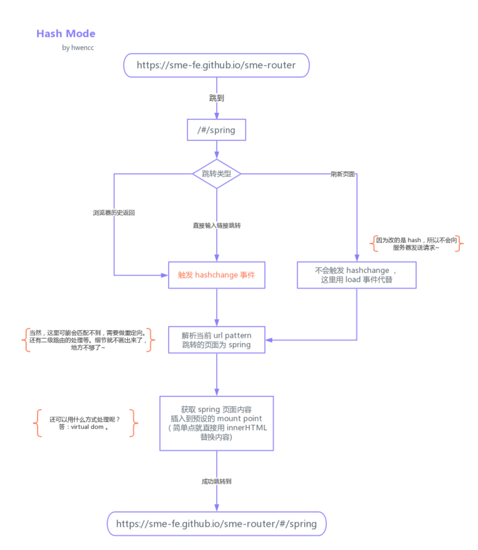
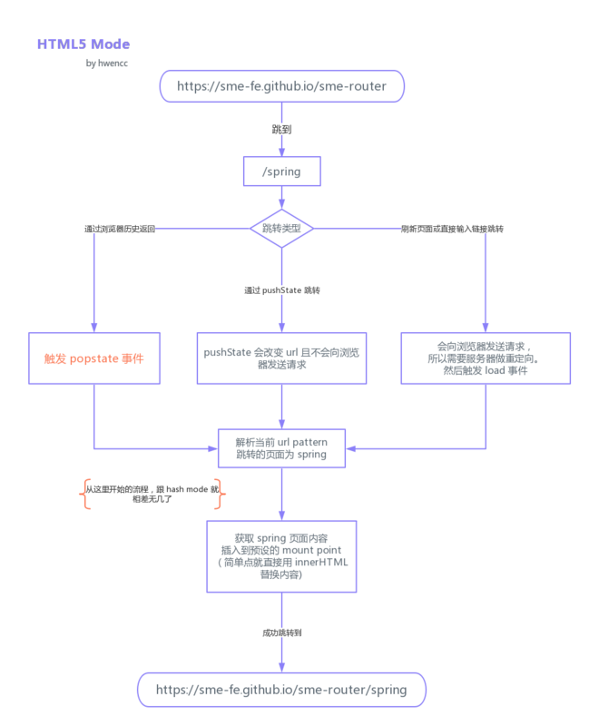

（https://www.html.cn/interview/15331.html）
## 你对MVVM的理解?

MVVM 模式，顾名思义即 Model-View-ViewModel 模式。

Model 层： 对应数据层模型，它主要通过 Ajax/fetch 等 API 完成客户端对数据模型进行同步。 在层间关系里，它主要用于抽象出 ViewModel 中视图的 Model。

View 层：作为视图模板存在，在 MVVM 里，整个 View 是一个动态模板。它展示了 ViewModel 层的数据和状态。View 层做的是 数据绑定的声明、 指令的声明、 事件绑定的声明。

ViewModel 层：处理 View 层的具体业务逻辑。ViewModel 底层会做好绑定属性的监听。当 ViewModel 中数据变化，View 层会得到更新；而当 View 中声明了数据的双向绑定，框架也会监听 View 层值的变化。一旦值变化，View 层绑定的 ViewModel 中的数据也会得到自动更新。

## vue响应式原理
（https://juejin.im/post/5c21a306e51d4526262966c3）
（https://www.html.cn/interview/15331.html）
（https://blog.fundebug.com/2019/07/10/responsive-vue/）
（https://github.com/berwin/Blog/issues/17）
（https://www.cxymsg.com/guide/reactivity.html）

在vue2.0中依赖Object.defineProperty方法，3.0主要依赖proxy api。在vue响应式系统中，有三个重要的概念，分别是Observer，Dep，Watch。
Observer : 它的作用是给对象的属性添加 getter 和 setter，用于依赖收集和派发更新。

Dep : 用于收集当前响应式对象的依赖关系,每个响应式对象包括子对象都拥有一个 Dep 实例（里面 subs 是 Watcher 实例数组）,当数据有变更时,会通过 dep.notify()通知各个 watcher。

Watcher : 观察者对象 , 实例分为渲染 watcher (render watcher),计算属性 watcher (computed watcher),侦听器 watcher（user watcher）三种。
当创建 Vue 实例时,vue 会遍历 data 选项的属性,利用 Object.defineProperty 为属性添加 getter 和 setter 对数据的读取进行劫持（getter 用来依赖收集,setter 用来派发更新）,并且在内部追踪依赖,在属性被访问和修改时通知变化。

每个组件实例会有相应的 watcher 实例,会在组件渲染的过程中记录依赖的所有数据属性（进行依赖收集,还有 computed watcher,user watcher 实例）,之后依赖项被改动时,setter 方法会通知依赖与此 data 的 watcher 实例重新计算（派发更新）,从而使它关联的组件重新渲染。

一句话总结:

vue.js 采用数据劫持结合发布-订阅模式,通过 Object.defineproperty 来劫持各个属性的 setter,getter,在数据变动时发布消息给订阅者,触发响应的监听回调

## Proxy与Object.defineProperty的优劣对比?

（https://github.com/YvetteLau/Blog/issues/25）
（https://juejin.im/post/5acd0c8a6fb9a028da7cdfaf#heading-12）
1. Object.definedProperty 的作用是劫持一个对象的属性，劫持属性的getter和setter方法，在对象的属性发生变化时进行特定的操作。而 Proxy 劫持的是整个对象。
2. Proxy 会返回一个代理对象，我们只需要操作新对象即可，而 Object.defineProperty 只能遍历对象属性直接修改。
3. Object.definedProperty 不支持数组，更准确的说是不支持数组的各种API，因为如果仅仅考虑arry[i] = value 这种情况，是可以劫持的，但是这种劫持意义不大。而 Proxy 可以支持数组的各种API。

#### Vue中的key到底有什么用？

key的作用主要就是为了性能优化，key让组件具有了唯一性，能让diff算法更快的找到需要更新的组件dom。如果组件被添加了key，vue diff算法会基于key重新排列元素顺序，并且会移除 key 不存在的元素。

简单说，不使用key就会原地复用，使用key就会对元素位置进行重新排列。key是为Vue中的vnode标记的唯一id,通过这个key,我们的diff操作可以更准确、更快速。

准确: 如果不加key,那么vue会选择复用节点(Vue的就地更新策略),导致之前节点的状态被保留下来,会产生一系列的bug.
快速: key的唯一性可以被Map数据结构充分利用,相比于遍历查找的时间复杂度O(n),Map的时间复杂度仅仅为O(1).

diff算法的过程为：
（https://github.com/aooy/blog/issues/2）

oldCh和newCh各有两个头尾的变量StartIdx和EndIdx，它们的2个变量相互比较，一共有4种比较方式。如果4种比较都没匹配，如果设置了key，就会用key进行比较，在比较的过程中，变量会往中间靠，一旦StartIdx>EndIdx表明oldCh和newCh至少有一个已经遍历完了，就会结束比较，这四种比较方式就是首、尾、旧尾新头、旧头新尾.

## vue中的key可以用index吗？
（https://segmentfault.com/a/1190000019961419）
（https://juejin.im/post/5e8694b75188257372503722#heading-3）
可以使用key，但是不推荐使用，因为用index作为key的话，某些情况下会影响性能，甚至出现bug。
如果你的列表顺序会改变，别用 index 作为 key，和没写基本上没区别，因为不管你数组的顺序怎么颠倒，index 都是 0, 1, 2 这样排列，导致 Vue 会复用错误的旧子节点，做很多额外的工作。列表顺序不变也尽量别用，可能会误导新人。

## vue中 keep-alive 组件的作用?

（https://juejin.im/post/5b407c2a6fb9a04fa91bcf0d）
#### 原理
1. 获取 keep-alive 包裹着的第一个子组件对象及其组件名
2. 根据设定的 include/exclude（如果有）进行条件匹配,决定是否缓存。不匹配,直接返回组件实例
3. 根据组件 ID 和 tag 生成缓存 Key,并在缓存对象中查找是否已缓存过该组件实例。如果存在,直接取出缓存值并更新该 key 在 this.keys 中的位置(更新 key 的位置是实现 LRU 置换策略的关键)
4. 在 this.cache 对象中存储该组件实例并保存 key 值,之后检查缓存的实例数量是否超过 max 的设置值,超过则根据 LRU 置换策略删除最近最久未使用的实例（即是下标为 0 的那个 key）
5. 最后组件实例的 keepAlive 属性设置为 true,这个在渲染和执行被包裹组件的钩子函数会用到,这里不细说

#### LRU 缓存淘汰算法

LRU（Least recently used）算法根据数据的历史访问记录来进行淘汰数据,其核心思想是“如果数据最近被访问过,那么将来被访问的几率也更高”。
keep-alive 的实现正是用到了 LRU 策略,将最近访问的组件 push 到 this.keys 最后面,this.keys[0]也就是最久没被访问的组件,当缓存实例超过 max 设置值,删除 this.keys[0]

keep-alive是vue中一个内置的组件，主要用于缓存组件，其会在组件created的时候，将需要缓存的组件放到缓存中，然后再render的时候再根据name进行取出。<keep-alive>主要配合路由进行使用，在配置路由的时候添加上meta元数据对象，里面添加上keepAlive属性，表示是否缓存该组件，然后将<router-view>放到<keep-alive>中，router-view通过v-if指令，从路由配置上的meta对象中取出keepAlive的值进行判断是否需要缓存，如:

<template>
  <div id="app">
      <keep-alive>
        <router-view v-if="$route.meta.keepAlive"/> <!--这个是需要缓存的-->
      </keep-alive>
        <router-view v-if="!$route.meta.keepAlive"></router-view><!--这个是不需要缓存的-->
  </div>
</template>
// 路由配置

export default new Router({
    routes: [
        {
          path: '/',
          name: 'home',
          component: Home,
          meta: {
            keepAlive: true
          }
        },
        {
          path: '/about',
          name: 'about',
          component: About,
          meta: {
            keepAlive: false
          }
        }
    ]
});
组件缓存后就不会执行组件的beforeCreate、created和beforeMount、mounted钩子了，所以其提供了actived和deactived钩子，
actived钩子主要用于承担原来created钩子中获取数据的任务。


## vue常用的修饰符

.stop 该修饰符将
阻止事件向上冒泡。同理于调用 event.stopPropagation() 方法，即如果当前元素添加了.stop修饰符，那么当点击该元素时候，click事件不会冒泡到其父元素上，即
父元素不会触发click事件。


.prevent 该修饰符会
阻止当前事件的默认行为。同理于调用 event.preventDefault() 方法，即如果<a href=”http://www.baidu.com”
@click.stop=”show”>连接，点击后默认会跳转到百度，但是添加上.stop修饰符之后，就
不会跳转到百度了，
而是执行show()方法了。


.self 该指令
只有当事件是从事件绑定的元素本身触发时才触发回调，即
冒泡事件到达该元素上时，
并不会触发事件，但是
其不影响事件继续向上冒泡，
其父元素仍然会触发冒泡事件


.native 就是
给自定义组件的根元素添加一个原生事件，所以其通常用在自定义组件上，
如果给普通的HTML元素添加.native修饰符，
那么该HTML元素将无法监听到该事件了。


.capture 就是
让事件监听变成捕获，默认为冒泡，
通常用于修饰父元素，如果给父元素添加@click.capture修饰符，那么当点击子元素的时候，父元素的click事件将先触发，然后才是子元素的click事件。


.once 该修饰符表示绑定的事件
只会被触发一次。
（https://segmentfault.com/a/1190000016786254）


## Vue生命周期的理解？

Vue 实例有一个完整的生命周期，也就是从开始创建、初始化数据、编译模版、挂载Dom -> 渲染、更新 -> 渲染、卸载等一系列过程，我们称这是Vue的生命周期。

beforeCreate	组件实例被创建之初，组件的属性生效之前
created	组件实例已经完全创建，属性也绑定，但真实dom还没有生成，$el还不可用
beforeMount	在挂载开始之前被调用：相关的 render 函数首次被调用
mounted	el 被新创建的 vm.$el 替换，并挂载到实例上去之后调用该钩子
beforeUpdate	组件数据更新之前调用，发生在虚拟 DOM 打补丁之前
update	组件数据更新之后
activited	keep-alive专属，组件被激活时调用
deadctivated	keep-alive专属，组件被销毁时调用
beforeDestory	组件销毁前调用
destoryed	组件销毁后调用


## 异步请求适合在哪个生命周期调用？
官方实例的异步请求是在mounted生命周期中调用的，而实际上也可以在created生命周期中调用。

## Vue组件如何通信？
Vue组件通信的方法如下:

props/$emit+v-on: 通过props将数据自上而下传递，而通过$emit和v-on来向上传递信息。
EventBus: 通过EventBus进行信息的发布与订阅
vuex: 是全局数据管理库，可以通过vuex管理全局的数据流
$attrs/$listeners: Vue2.4中加入的$attrs/$listeners可以进行跨级的组件通信
provide/inject：以允许一个祖先组件向其所有子孙后代注入一个依赖，不论组件层次有多深，并在起上下游关系成立的时间里始终生效，这成为了跨组件通信的基础。

## computed 的实现原理
computed 本质是一个惰性求值的观察者。computed 内部实现了一个惰性的 watcher,也就是 computed watcher,computed watcher 不会立刻求值,同时持有一个 dep 实例。其内部通过 this.dirty 属性标记计算属性是否需要重新求值。当 computed 的依赖状态发生改变时,就会通知这个惰性的 watcher,computed watcher 通过 this.dep.subs.length 判断有没有订阅者,有的话,会重新计算,然后对比新旧值,如果变化了,会重新渲染。 (Vue 想确保不仅仅是计算属性依赖的值发生变化，而是当计算属性最终计算的值发生变化时才会触发渲染 watcher 重新渲染，本质上是一种优化。)没有的话,仅仅把 this.dirty = true。 (当计算属性依赖于其他数据时，属性并不会立即重新计算，只有之后其他地方需要读取属性的时候，它才会真正计算，即具备 lazy（懒计算）特性。)

## computed和watch有什么区别?
区别
computed 计算属性 : 依赖其它属性值,并且 computed 的值有缓存,只有它依赖的属性值发生改变,下一次获取 computed 的值时才会重新计算 computed 的值。

watch 侦听器 : 更多的是「观察」的作用,无缓存性,类似于某些数据的监听回调,每当监听的数据变化时都会执行回调进行后续操作。

运用场景：

当我们需要进行数值计算,并且依赖于其它数据时,应该使用 computed,因为可以利用 computed 的缓存特性,避免每次获取值时,都要重新计算。

当我们需要在数据变化时执行异步或开销较大的操作时,应该使用 watch,使用 watch 选项允许我们执行异步操作 ( 访问一个 API ),限制我们执行该操作的频率,并在我们得到最终结果前,设置中间状态。这些都是计算属性无法做到的。

## 既然Vue通过数据劫持可以精准探测数据变化,为什么还需要虚拟DOM进行diff检测差异?
现代前端框架有两种方式侦测变化,一种是pull一种是push

pull: 其代表为React,我们可以回忆一下React是如何侦测到变化的,我们通常会用setStateAPI显式更新,然后React会进行一层层的Virtual Dom Diff操作找出差异,然后Patch到DOM上,React从一开始就不知道到底是哪发生了变化,只是知道「有变化了」,然后再进行比较暴力的Diff操作查找「哪发生变化了」，另外一个代表就是Angular的脏检查操作。

push: Vue的响应式系统则是push的代表,当Vue程序初始化的时候就会对数据data进行依赖的收集,一但数据发生变化,响应式系统就会立刻得知,因此Vue是一开始就知道是「在哪发生变化了」,但是这又会产生一个问题,如果你熟悉Vue的响应式系统就知道,通常一个绑定一个数据就需要一个Watcher,一但我们的绑定细粒度过高就会产生大量的Watcher,这会带来内存以及依赖追踪的开销,而细粒度过低会无法精准侦测变化,因此Vue的设计是选择中等细粒度的方案,在组件级别进行push侦测的方式,也就是那套响应式系统,通常我们会第一时间侦测到发生变化的组件,然后在组件内部进行Virtual Dom Diff获取更加具体的差异,而Virtual Dom Diff则是pull操作,Vue是push+pull结合的方式进行变化侦测的.

## Vue为什么没有类似于React中shouldComponentUpdate的生命周期？

根本原因是Vue与React的变化侦测方式有所不同

React是pull的方式侦测变化,当React知道发生变化后,会使用Virtual Dom Diff进行差异检测,但是很多组件实际上是肯定不会发生变化的,这个时候需要用shouldComponentUpdate进行手动操作来减少diff,从而提高程序整体的性能.

Vue是pull+push的方式侦测变化的,在一开始就知道那个组件发生了变化,因此在push的阶段并不需要手动控制diff,而组件内部采用的diff方式实际上是可以引入类似于shouldComponentUpdate相关生命周期的,但是通常合理大小的组件不会有过量的diff,手动优化的价值有限,因此目前Vue并没有考虑引入shouldComponentUpdate这种手动优化的生命周期.


## 为什么 Vuex 的 mutation 和 Redux 的 reducer 中不能做异步操作？

要在reducer中加入异步的操作，如果你只是单纯想执行异步操作，不会等待异步的返回，那么在reducer中执行的意义是什么。如果想把异步操作的结果反应在state中，首先整个应用的状态将变的不可预测，违背Redux的设计原则，其次，此时的currentState将会是promise之类而不是我们想要的应用状态，根本是行不通的。
因为异步操作是成功还是失败不可预测，什么时候进行异步操作也不可预测；当异步操作成功或失败时，如果不 commit(mutation) 或者 dispatch(action)，Vuex 和 Redux 就不能捕获到异步的结果从而进行相应的操作
因为更改state的函数必须是纯函数，纯函数既是统一输入就会统一输出，没有任何副作用；如果是异步则会引入额外的副作用，导致更改后的state不可预测；
中文翻译可能有些偏差（不是我翻的）。区分 actions 和 mutations 并不是为了解决竞态问题，而是为了能用 devtools 追踪状态变化。事实上在 vuex 里面 actions 只是一个架构性的概念，并不是必须的，说到底只是一个函数，你在里面想干嘛都可以，只要最后触发 mutation 就行。异步竞态怎么处理那是用户自己的事情。vuex 真正限制你的只有 mutation 必须是同步的这一点（在 redux 里面就好像 reducer 必须同步返回下一个状态一样）。同步的意义在于这样每一个 mutation 执行完成后都可以对应到一个新的状态（和 reducer 一样），这样 devtools 就可以打个 snapshot 存下来，然后就可以随便 time-travel 了。如果你开着 devtool 调用一个异步的 action，你可以清楚地看到它所调用的 mutation 是何时被记录下来的，并且可以立刻查看它们对应的状态。其实我有个点子一直没时间做，那就是把记录下来的 mutations 做成类似 rx-marble 那样的时间线图，对于理解应用的异步状态变化很有帮助。

## data为什么还要写成函数的形式

Vue 的组件都是可复用的，一个组件创建好后，可以在多个地方复用，而不管复用多少次，组件内的data都应该是相互隔离，互不影响的，所以组件每复用一次，data就应该复用一次，每一处复用组件的data改变应该对其他复用组件的数据不影响。

为了实现这样的效果，data就不能是单纯的对象，而是以一个函数返回值的形式，所以每个组件实例可以维护独立的数据拷贝，不会相互影响。

这是官方的解释：
当一个组件被定义， data 必须声明为返回一个初始数据对象的函数，因为组件可能被用来创建多个实例。如果 data 仍然是一个纯粹的对象，则所有的实例将共享引用同一个数据对象！通过提供 data 函数，每次创建一个新实例后，我们能够调用 data 函数，从而返回初始数据的一个全新副本数据对象。

## nextTick是什么？与什么用，实现原理是啥
（https://juejin.im/post/5a6fdb846fb9a01cc0268618）
（https://blog.csdn.net/zhouzuoluo/article/details/84752280）
（https://cn.vuejs.org/v2/guide/reactivity.html#search-query-nav）

## vue的模板编译原理
（https://github.com/berwin/Blog/issues/18）
（https://www.jianshu.com/p/1c321032c83e）

## 为什么 v-for 和 v-if 不建议用在一起
v-for比v-if优先级更高，所以不建议v-for和v-if一起使用，如果v-for和v-if同时使用，那么数据发生变化时，v-for首先会进行遍历，然后通过v-if进行判断，这样
v-for和v-if都会同时执行一遍，对性能和展现不友好。所以
vue建议用计算属性进行替代，返回过滤后的列表再进行遍历。


17. 前端路由实现原理

26. vue router实现

27. vue-router导航守卫有哪些？
导航主要有三类钩子:
全局级路由钩子、
路由级路由钩子、
组件级路由钩子。主要参数有to(目标路由对象)、from(当前路由对象)、next(是一个函数，用于控制是否放行，即是否能通过当前守卫)。

全局级路由钩子: beforeEach和afterEach，每次路由跳转全局路由钩子都会执行，beforeEach(to, from, next)钩子有三个参数，但是afterEach是已经跳转结束了，所以其没有next参数，afterEach(to, from)，全局路由钩子由router对象调用。
路由级路由钩子: 路由级钩子只有一个即beforeEnter，其是在配置路由表的时候配置，也是有to、from、next三个参数，只有进入该路由的时候才会执行，如果是动态路由之间的切换，那么则不会触发beforeEnter钩子，因为是同一个路由，只是参数不一样。
组件级路由钩子: beforeRouteEnter(路由进入该组件的时候执行)、beforeRouteUpdate(动态路由切换时候执行)、beforeRouteLeave(路由离开当前组件的时候执行)，需要注意的是，路由钩子是优先于组件的生命周期的，也就是说路由钩子全部执行完毕之后才会开始组件的生命周期，所以其钩子执行顺序: beforeRouteLeave –> beforeEach –> beforeEnter –> beforeRouteEnter –> afterEach –> beforeCreate –> created –> mounted，beforeRouteUpdate只有动态路由切换的时候才会执行，即/user/1切换到/user/2才会执行。

29. vue3.0的理解

30. vue当中的指令和它的用法

## 什么是路由懒加载？其原理是什么？

（https://www.jqhtml.com/59114.html）


## 前端路由实现

路由这个概念最先是后端出现的。在以前用模板引擎开发页面时，经常会看到这样
http://hometown.xxx.edu.cn/bbs/forum.php
有时还会有带.asp或.html的路径，这就是所谓的SSR(Server Side Render)，通过服务端渲染，直接返回页面。
其响应过程是这样的
1.浏览器发出请求
2.服务器监听到80端口（或443）有请求过来，并解析url路径
3.根据服务器的路由配置，返回相应信息（可以是 html 字串，也可以是 json 数据，图片等）
4.浏览器根据数据包的Content-Type来决定如何解析数据

简单来说路由就是用来跟后端服务器进行交互的一种方式，通过不同的路径，来请求不同的资源，请求不同的页面是路由的其中一种功能。

前端路由的诞生的缘由
前端路由的出现要从 ajax 开始，为什么？且听下面分析 (ˉ▽￣～)

Ajax，全称 Asynchronous JavaScript And XML，是浏览器用来实现异步加载的一种技术方案。在 90s 年代初，大多数的网页都是通过直接返回 HTML 的，用户的每次更新操作都需要重新刷新页面。及其影响交互体验，随着网络的发展，迫切需要一种方案来改善这种情况。

1996，微软首先提出 iframe 标签，iframe 带来了异步加载和请求元素的概念，随后在 1998 年，微软的 Outloook Web App 团队提出 Ajax 的基本概念（XMLHttpRequest的前身），并在 IE5 通过 ActiveX 来实现了这项技术。在微软实现这个概念后，其他浏览器比如 Mozilia，Safari，Opera 相继以 XMLHttpRequest 来实现 Ajax。（? 兼容问题从此出现，话说微软命名真喜欢用X，MFC源码一大堆。。）不过在 IE7 发布时，微软选择了妥协，兼容了 XMLHttpRequest 的实现。
[vue router hash源码]（https://github.com/vuejs/vue-router/blob/dev/src/history/hash.js#L22-L54）

有了 Ajax 后，用户交互就不用每次都刷新页面，体验带来了极大的提升。

但真正让这项技术发扬光大的，还是后来的 Google Map，它的出现向人们展现了 Ajax 的真正魅力，释放了众多开发人员的想象力，让其不仅仅局限于简单的数据和页面交互，为后来异步交互体验方式的繁荣发展带来了根基。

而异步交互体验的更高级版本就是 SPA（那么问个问题，异步交互最高级的体验是什么？会在文末揭晓）—— 单页应用。单页应用不仅仅是在页面交互是无刷新的，连页面跳转都是无刷新的，为了实现单页应用，所以就有了前端路由。

单页应用的概念是伴随着 MVVM 出现的。最早由微软提出，然后他们在浏览器端用 Knockoutjs 实现。但这项技术的强大之处并未当时的开发者体会到，可能是因为 Knockoutjs 实现过于复杂，导致没有大面积的扩散。

同样，这次接力的选手依然是 Google。Google 通过 Angularjs 将 MVVM 及单页应用发扬光大，让前端开发者能够开发出更加大型的应用，职能变得更大了。（不得不感慨，微软 跟 Google 都是伟大的公司）。随后都是大家都知道的故事，前端圈开始得到了爆发式的发展，陆续出现了很多优秀的框架。

从 vue-router 来看前端路由实现原理
前端路由的实现其实很简单。
[h5 history解读](https://router.vuejs.org/zh/guide/essentials/history-mode.html)

本质上就是检测 url 的变化，截获 url 地址，然后解析来匹配路由规则。

但是这样有人就会问：url 每次变化都会刷新页面啊？页面都刷新了，JavaScript 怎么检测和截获 url？

在 2014 年之前，大家是通过 hash 来实现路由，url hash 就是类似于

https://segmentfault.com/a/1190000011956628#articleHeader2

这种 #。后面 hash 值的变化，并不会导致浏览器向服务器发出请求，浏览器不发出请求，也就不会刷新页面。另外每次 hash 值的变化，还会触发 hashchange 这个事件，通过这个事件我们就可以知道 hash 值发生了哪些变化。

让我们来整理思路，假如我们要用 hash 的模式实现一个路由，那么流程应该是这样的。


hash-mode

hash 的实现相对来说要简单方便些，而且不用服务器来支持。

另外我们可以参考参考 vue-router 这一部分的实现（为了便于解释我简化了部分代码）

vue-router hash 实现源码地址

```
/**
 * 添加 url hash 变化的监听器
 */
setupListeners () {
  const router = this.router

  /**
   * 每当 hash 变化时就解析路径
   * 匹配路由
   */
  window.addEventListener('hashchange', () => {
    const current = this.current
    /**
     * transitionTo:
     * 匹配路由
     * 并通过路由配置，把新的页面 render 到 ui-view 的节点
     */
    this.transitionTo(getHash(), route => {
      replaceHash(route.fullPath)
    })
  })
}
```
检测到 hash 的变化后，就可以通过替换 DOM 的方式来实现页面的更换。

14年后，因为HTML5标准发布。多了两个 API，pushState 和 replaceState，通过这两个 API 可以改变 url 地址且不会发送请求。同时还有 onpopstate 事件。通过这些就能用另一种方式来实现前端路由了，但原理都是跟 hash 实现相同的。用了 HTML5 的实现，单页路由的 url 就不会多出一个#，变得更加美观。但因为没有 # 号，所以当用户刷新页面之类的操作时，浏览器还是会给服务器发送请求。为了避免出现这种情况，所以这个实现需要服务器的支持，需要把所有路由都重定向到根页面。具体可以见：HTML5 histroy 模式

同样，我们来理清下思路，这样写起代码才更得心应手~

html5-mode

这部分 vue-router 的源码，可以发现实现的思路大体也是相同的
[history router源码](https://github.com/vuejs/vue-router/blob/dev/src/history/html5.js)
```
export class HTML5History extends History {
  constructor (router, base) {
    super(router, base)
    /**
     * 原理还是跟 hash 实现一样
     * 通过监听 popstate 事件
     * 匹配路由，然后更新页面 DOM
     */
    window.addEventListener('popstate', e => {
      const current = this.current

      // Avoiding first `popstate` event dispatched in some browsers but first
      // history route not updated since async guard at the same time.
      const location = getLocation(this.base)
      if (this.current === START && location === initLocation) {
        return
      }

      this.transitionTo(location, route => {
        if (supportsScroll) {
          handleScroll(router, route, current, true)
        }
      })
    })
  }
```


